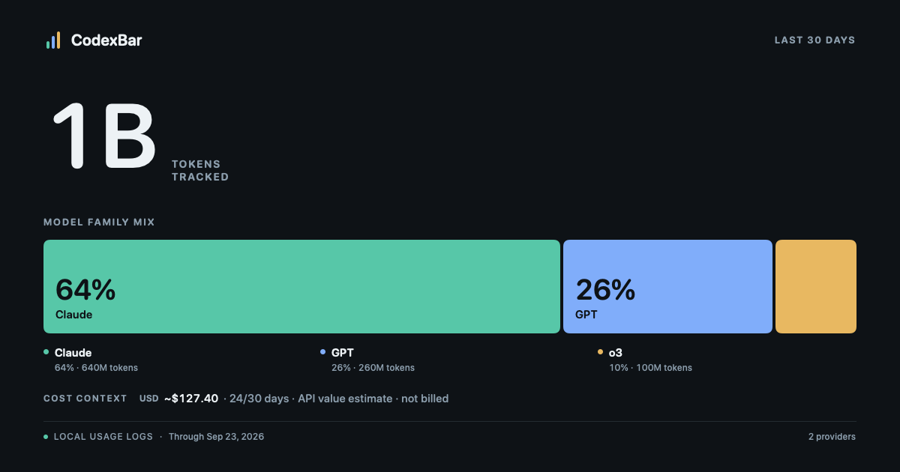
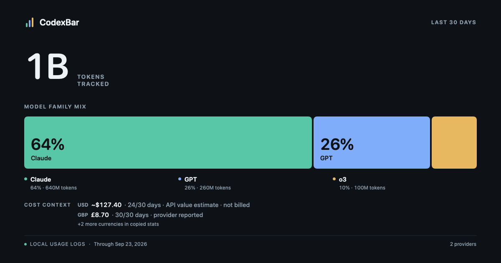

# Shareable usage card direction

September 23, 2026. The images below use **synthetic values**. They render the current `ShareStatsCardView` at its 1200 × 630 export size; they do not show Alec's account or prove an installed app flow.

## Job and composition

The card should give someone a shareable picture of their observed AI use in one glance. The tracked token total is the hero. The measured model family mix becomes the visual object: proportional blocks, each colored by its position in the ranking, with the largest blocks labeled inside. Identically named models are aggregated across serving providers for this view, so one family cannot appear twice with unexplained percentages. A compact legend retains the shares and token amounts for smaller blocks. The remaining chrome uses the existing CodexBar mark, dark surface, and rounded type.

The cost area remains subordinate and names each currency's covered days and basis. A public API price calculation says “API value estimate · not billed”; provider-reported and mixed values keep their own labels. The image displays at most two currency rows and points to Copy Stats for any remainder, keeping the model composition and footer in frame. The footer counts distinct providers, rather than account rows. “Local snapshot” describes where the image is made without claiming that every displayed cost came from local logs. All-time coverage uses a counted number of days rather than `12/all`, which suggested a denominator that does not exist. When model coverage is incomplete, the title says “Known model family mix” and the card explains that some model data is unavailable.

The small widget omits the share control so long provider names keep their header space. Medium and large widgets retain the share link.

## Reference boundary

The [consumption and share-card research](../research/consumption-language-and-share-card-patterns-2026-09-22.md) found the useful part of FOMO and the supplied 0xTria example to be the single dominant fact and legible share hierarchy. The 0xTria card was editable and could show fabricated data, so its visual confidence cannot serve as evidence. Spotify Wrapped suggests one insight per exported image. OpenRouter and Vercel offer model-composition patterns, but CodexBar's export uses only its own sanitized local payload. No peer rank, savings, or billing claim is inferred.

## Critique

- The earlier 13-pixel model ribbon was accurate but too small to carry the card; the large empty middle made the image read like a dashboard excerpt.
- The proportional composition now has a visual job. Distinct family colors keep two models served by the same provider distinguishable.
- The four-currency case retains the footer and explicitly points to values omitted from the image; the complete numbers remain available through Copy Stats.
- At social preview scale, the token total and the main composition remain legible. Small cost and source labels still require opening the image, so they stay outside the main focal path.
- The synthetic native render verifies this composition only. Live preview, clipboard, saved PNG, and account-specific long labels remain separate release checks.
