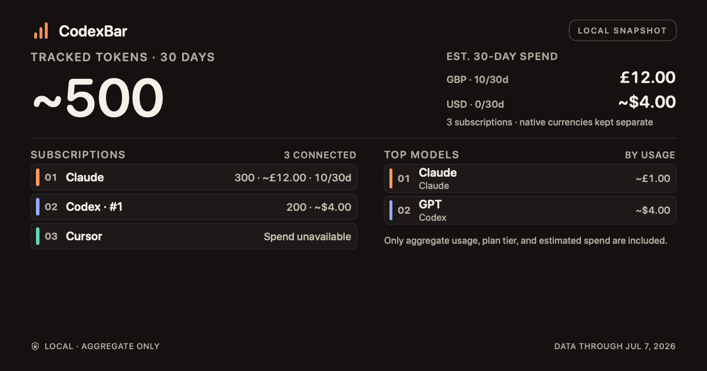

# Overview sharing proof

Synthetic data only. Captured on disposable macOS CI runners on 2026-09-16.

[Run 35080951899](https://github.com/Chipagosfinest/CodexBar/actions/runs/35080951899), source `f73a08a2f`, passed all 17 `ShareStatsTests` and the explicitly selected native menu test. The native test dispatched the real overview action, opened its visible preview, and verified a selected $2 payload excluded a hidden $900 source. Return activated the actual default Copy Image control; the test verified a new clipboard write containing PNG and TIFF, with PNG dimensions 1200 × 630. Clipboard writes occurred only in the disposable CI runner.

The exported image was visually inspected. The two hosting-view captures below were also inspected: they show the filtered card, but **omit the native button row**. They therefore do not establish visible copied feedback. Do not treat a file named `copied` as proof of that label. These are native test-host results, not installed desktop-widget proof.

- [Preview hosting-view capture](overview-share-preview.png)
- [Hosting-view capture after successful clipboard assertions](overview-share-preview-copied.png)

Current source `b7d76395a` additionally checks the actual menu title and preview accessibility labels for Copy Image and Image copied in English/German. [Run 35082637466](https://github.com/Chipagosfinest/CodexBar/actions/runs/35082637466) is pending. Task-local language propagation and native labels must pass before claiming non-English UI proof.

The layout correction follows [Apple NSWindow.layoutIfNeeded](https://developer.apple.com/documentation/appkit/nswindow/layoutifneeded()), accessed 2026-09-16. Accessibility traversal follows [Apple accessibilityChildren](https://developer.apple.com/documentation/AppKit/NSAccessibility-c.protocol/accessibilityChildren) and the repository's existing SwiftUI-node fallback. No manual hosting-view size was assigned.

## Composited window captures — verified 2026-09-16

[Run 35083394374](https://github.com/Chipagosfinest/CodexBar/actions/runs/35083394374), source `34cd766684da8ebf7ce242d6f7729234e4a3fddf`, produced the actual window captures below. Visual inspection confirms the full controls and success feedback in English and German. The menu, filtered payload, Return-key activation, and PNG/TIFF clipboard assertions passed.

- [English before copy](overview-share-window.png)
- [English after copy: Image copied](overview-share-window-copied.png)
- [German before copy: Bild kopieren](overview-share-window-de.png)
- [German after copy: Bild kopiert](overview-share-window-copied-de.png)

**The run failed overall:** its accessibility traversal returned an empty array before and after copy in both languages. These captures resolve the earlier missing-toolbar visual uncertainty, but do not resolve the accessibility-probe failure or establish VoiceOver behavior. Do not report this run as passing. Installed-widget dispatch remains a separate unverified boundary.

## Proof boundary correction

The native menu/copy proof retains exact localized menu-title, selected-payload, actual keyboard action, clipboard change, PNG/TIFF and image-dimension checks. Its workflow now requires actual compositor captures before and after copy in both languages, with visual inspection. Recursive accessibility-tree enumeration is a distinct opt-in via `CODEXBAR_OVERVIEW_ACCESSIBILITY_PROOF=1`; default runs explicitly state that accessibility was not verified. This does not certify VoiceOver behavior or turn the prior failed run into a passing result.
