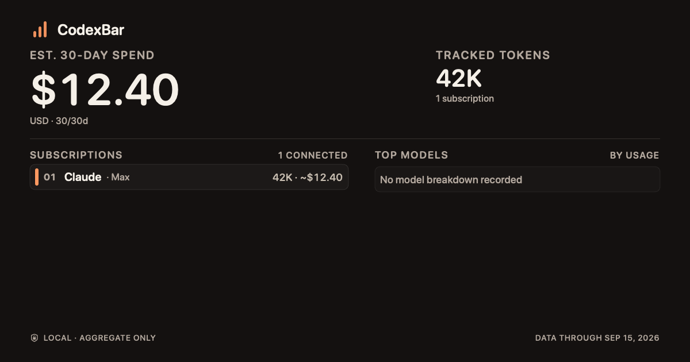
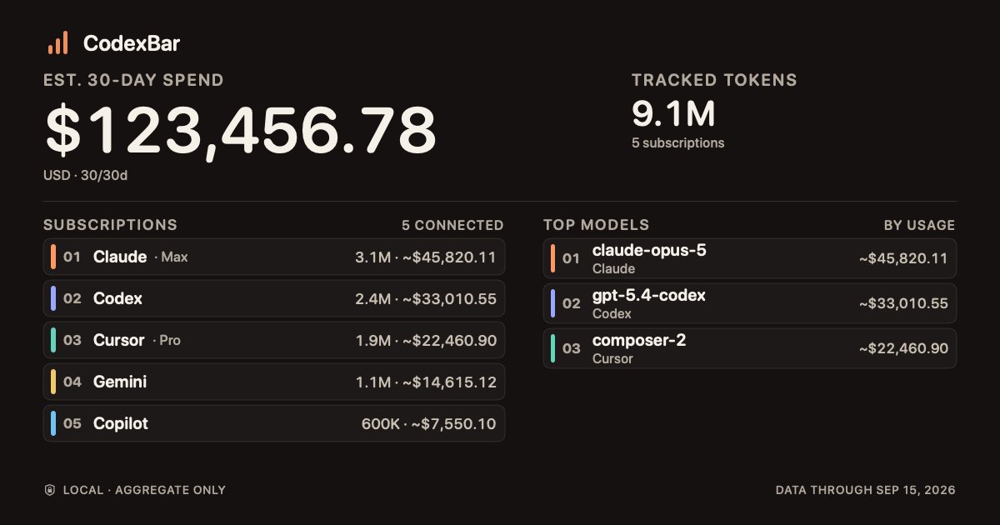
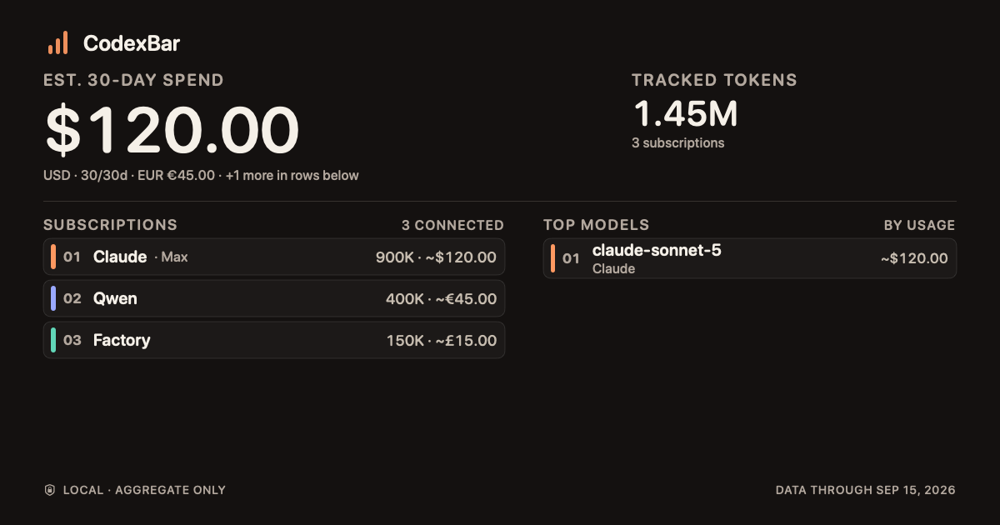

# Shared usage card: spend-first layout

Rendered 2026-09-17 against `b6e65a83d`.

`ShareStatsCardView` is a pure function of `ShareStatsPayload`, so these images were produced by
compiling the view verbatim with the payload types and `ShareStatsFormatting` from each revision,
then rendering through `ImageRenderer` at the card's own `1200x630`. `UsageFormatter.currencyString`
and `SpendDashboardSource.scanDays` are the only two symbols stubbed; neither affects layout.

Three payloads, chosen to cover the cases the change is argued on:

| Payload | Why |
|---|---|
| sparse | 1 subscription, no model history — the case that left dead space above the footer |
| dense | 5 subscriptions, 3 models, `~$123,456.78` — the tightest vertical and horizontal case |
| multi | 3 currencies — exercises the secondary-currency coverage line |

## Findings

**Dense fits.** The `286pt` rankings reservation is load-bearing: with five provider rows, three
model rows and a seven-character spend figure, the footer stays clear and nothing clips. An earlier
revision of this branch removed that reservation, which would have pushed the footer out of the
image since SwiftUI does not clip an oversize frame.

**The hero no longer scales.** `~$123,456.78` renders unscaled at 76pt. At the original 104pt it
needed roughly 660-780pt against 654pt of available width, so it would have silently shrunk.

**Centring the sparse card was wrong.** An intermediate revision centred the rankings block inside
its reservation. That split the empty space in two and put a gap directly under the divider, which
reads as a layout fault. Top alignment leaves one contiguous region below the content, which reads
as "that is all there is". Reverted.

**The period badge was a second redundancy.** Replacing `LOCAL SNAPSHOT` with the period label put
`30 DAYS` directly above `EST. 30-DAY SPEND`. The badge is removed entirely rather than re-labelled.

Not a production-bundle render: the app itself was not built for these. The view code is byte-identical
to the branch, so layout and typography are faithful, but a maintainer wanting output from a signed
build should treat these as the layout argument rather than the final artifact.

## Production-path proof (added 2026-09-21)

The images above go through `ImageRenderer`, not the app's own exporter. `Tests/CodexBarTests/
ShareStatsLayoutProductionRenderTests.swift` renders the same three payload shapes through
`ShareStatsRenderer.pngData` — the literal `NSHostingView` renderer `ShareStatsExporter.saveImage`/
`copyImage` call in production — and asserts each PNG is non-trivial (`> 10_000` bytes, ruling out a
blank frame). Run with `CODEXBAR_SHARE_STATS_SCREENSHOT_DIR=<dir> swift test --filter
ShareStatsLayoutProductionRenderTests` to regenerate; committed output below.

| sparse | dense | multi |
|---|---|---|
|  |  |  |
