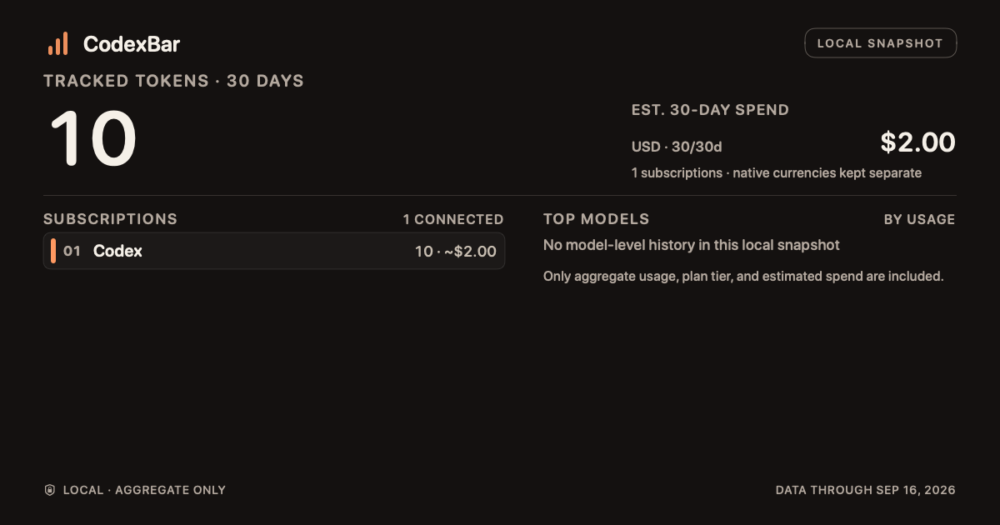

# Share snapshot reporting date

Observed 2026-09-16 against upstream `639b15522`.

The shared card displayed September 17 during a September 16 native proof. The dashboard chart deliberately extends to the next day's start, but the share payload used that chart endpoint as its human-facing “Data through” date. [Recorded native proof](https://github.com/Chipagosfinest/CodexBar/actions/runs/35083394374).

The patch names the last included civil day using the currency group's calendar, and carries its timezone into the common image/text formatter. It does not alter the chart interval, spend totals, or token totals. The date describes the selected reporting window, not the last observed usage event.

Six real-dashboard regressions cover UTC, UTC+14, spring/fall DST, Santiago's midnight DST transition, and year-end. [Remote run 35120325632](https://github.com/Chipagosfinest/CodexBar/actions/runs/35120325632), source `5dcaad1a3b99eef08633d51519a6138b8b20934b`, passed all 16 focused tests in two suites, including all six date cases. The required production-renderer PNG was visually inspected: its footer says September 16, matching the fixture reporting day. Targeted formatting and independent source review passed; full upstream CI remains a separate gate. This concern is separate from the menu and widget sharing entry points.

Primary API reference: [Apple Calendar dateInterval(of:for:)](https://developer.apple.com/documentation/foundation/calendar/dateinterval(of:for:)), accessed 2026-09-16. The calculation uses an instant inside the chart boundary and the calendar's start of day, rather than assuming every day lasts 24 hours.

Full upstream CI caught the existing architecture allowlist's line anchor moving from 195 to 198 after the payload timezone field was added. The anchor now follows the unchanged model-family sanitizer; its reason, expected provider IDs, and fingerprint are unchanged. Focused architecture/date and full current-head CI are pending this correction.
