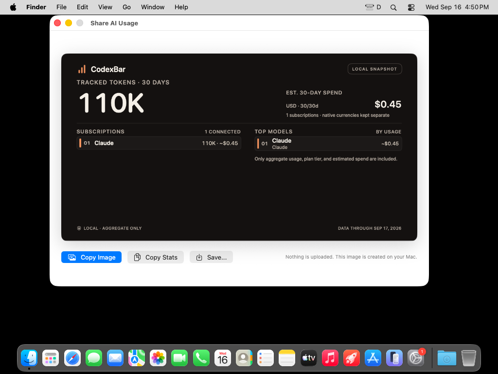
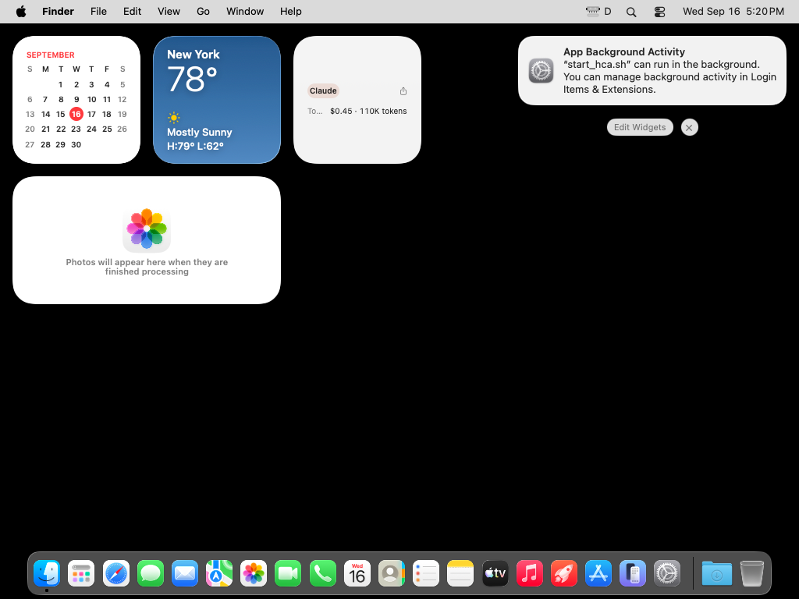
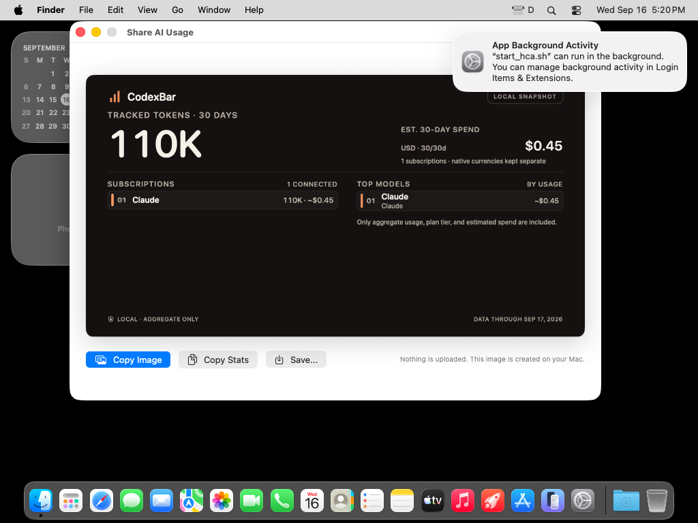
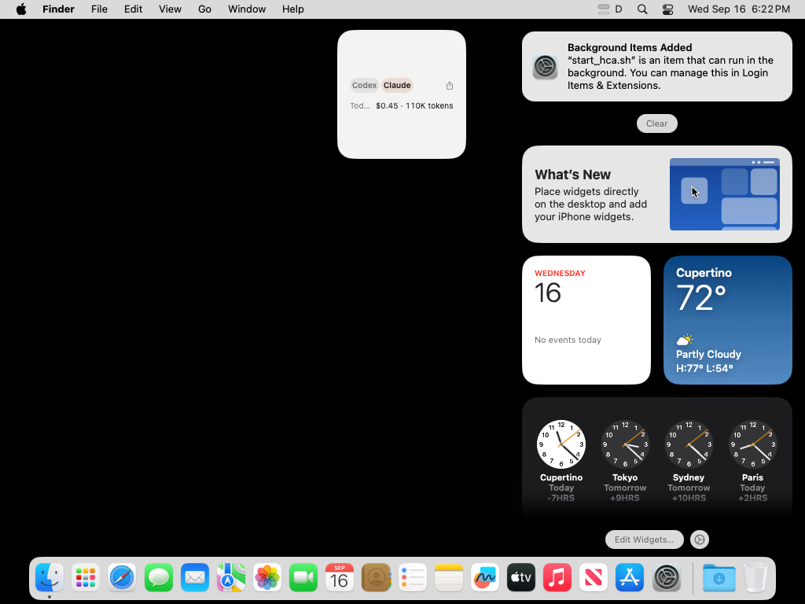
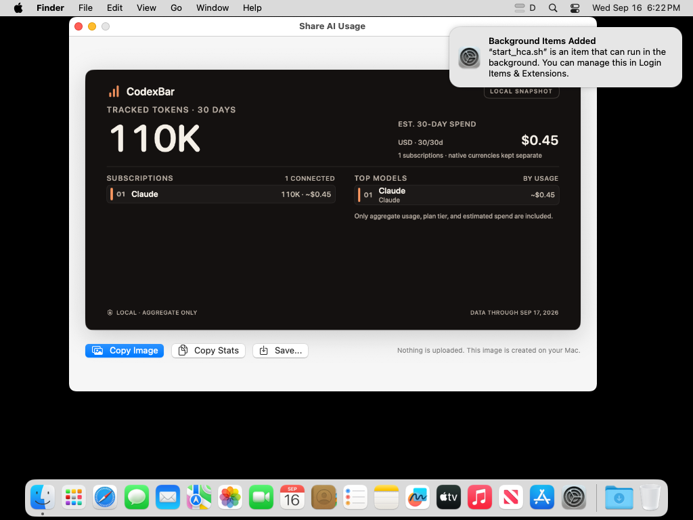

# Widget share layout proof

Observed 2026-09-16 PT in [macOS proof run 35077951215](https://github.com/Chipagosfinest/CodexBar/actions/runs/35077951215), source `e880687f9dd4ee2ebe262eeb72f54a042eef72c3`. All usage values are synthetic.

Three route tests passed, including data-free URL validation, rejection of unsupported destinations/data, and queued cold-launch delivery. One explicit native XCTest rendered nine production layouts with zero failures. Usage, History, and Switcher bodies use the same family-specific content called by this renderer; the test does not attempt to overwrite WidgetKit's read-only family environment.

The native host simulates 16-point margins around 160 × 160, 360 × 160, and 360 × 380 canvases. The dense fixture includes two quota rows, code-review usage, and three Switcher providers. All nine images were visually inspected. Compact chip labels stay on one line; “Clau…” is intentional truncation with the full provider name exposed to accessibility. No share control or usage row is visibly clipped.

| Layout | Native capture |
| --- | --- |
| Compact Small | [PNG](assets/widget-share/share-overview-compact-small.png) |
| History Large | [PNG](assets/widget-share/share-overview-history-large.png) |
| History Medium | [PNG](assets/widget-share/share-overview-history-medium.png) |
| Switcher Large | [PNG](assets/widget-share/share-overview-switcher-large.png) |
| Switcher Medium | [PNG](assets/widget-share/share-overview-switcher-medium.png) |
| Switcher Small | [PNG](assets/widget-share/share-overview-switcher-small.png) |
| Usage Large | [PNG](assets/widget-share/share-overview-usage-large.png) |
| Usage Medium | [PNG](assets/widget-share/share-overview-usage-medium.png) |
| Usage Small | [PNG](assets/widget-share/share-overview-usage-small.png) |

These captures verify production layout content in an NSHostingView. They do not verify an installed WidgetKit container, wallpaper-dependent rendering, system-supplied margins, or an actual desktop click into a warm/cold app. The later installed small Switcher proof below covers one real system container and warm/cold widget clicks. Other families, upgrades from older widgets, the prerequisite menu-sharing PR #3677, and current-head CI remain separate gates.

The URL contains no account, provider, usage, spend, callback, or file data. Opening the preview does not upload or copy an image; Copy Image remains an explicit action in the app.

## Packaged app URL proof

[Run 35124298076](https://github.com/Chipagosfinest/CodexBar/actions/runs/35124298076) reused the actual debug package from source `d223726ffd8d9d60c3eab54af55e730b7291669c`, including its embedded WidgetKit extension. The package passed strict signature and bundle-metadata checks. The app launched outside XCTest on a disposable macOS 26.6.2 runner with synthetic Claude usage and no real credentials.

The named warm/cold test executed: one passed, zero failed, zero skipped. Opening the data-free share URL while running and again after terminating the disposable debug app each produced exactly one accessible preview containing Claude, 110K tokens, and $0.45 estimated spend. The app retained the explicitly seeded Claude-only configuration. This verifies the real URL/AppDelegate/payload path. It does not verify clicking an installed widget.

Both warm and cold captures passed a light-margin/dark-card pixel check before the test explicitly activated the app. Root inspected the actual PNG pixels and the populated preview. An earlier apparent black image in the inspection tool was not present in the decoded PNG; it was an inspection artifact, not a product or capture defect. The separate gallery diagnostic found Finder desktop and Control Center clock controls but did not open the gallery or install a widget. The footer in this package still shows the next day; the independent correction is [PR #3692](https://github.com/steipete/CodexBar/pull/3692). Copy was not invoked in this packaged-app run.

## Installed small Switcher proof

[Run 35127320260](https://github.com/Chipagosfinest/CodexBar/actions/runs/35127320260), observed 2026-09-16, passed one named installed-widget GUI test with zero failures or skips. Harness `7ae187ba8720d8f62f44bf02fa205f8f0a9a0e03` used the same packaged product source `d223726ffd8d9d60c3eab54af55e730b7291669c`. Production sources are unchanged by the later evidence commits.

The test opened the real macOS widget gallery, selected CodexBar's small Switcher, dragged it onto the desktop, and exited both gallery and desktop editing. It required an installed `widget-local:` debug Switcher with the app-published synthetic Claude snapshot (110K tokens and $0.45). Clicking the widget body opened one populated Share AI Usage preview. After closing that preview and terminating only the disposable debug app, clicking the retained widget cold-launched the app into the same populated preview. Neither installed-widget click used a direct URL invocation.

Root inspected the installed widget and preview PNGs alongside accessibility evidence. This proves a newly added small Switcher, its real system container, consumption of the shared snapshot, and the retained widget's warm/cold share route on the disposable macOS 26.6.2 runner. The footer date still belongs to the independent #3692 correction. The sparse fixture's Today label truncates; full accessibility text remains present, and this capture does not establish dense real-system layout quality.

The macOS 15 provider-button proof below supplements this single-provider run. Medium/large explicit share links, other installed widget families, VoiceOver, and upgrade of a widget created by an older app version remain unverified. Retaining the widget across an app restart is not an upgrade test. No real account, credential, user clipboard, or user desktop was used. The test temporarily restored Notification Center on the fresh runner because runner-images disables it, and restored that original disabled state afterward.

## Installed provider switching alongside sharing

[Run 35133736627](https://github.com/Chipagosfinest/CodexBar/actions/runs/35133736627), observed 2026-09-16, passed the named installed-widget test with zero failures or skips on macOS 15.7.9 arm64. Harness `5679870778607dd172e357ded0e115f4e66f8125` ran the unchanged package from product source `d223726ffd8d9d60c3eab54af55e730b7291669c`; Xcode 16.4 compiled only the external UI harness.

With both Codex and Claude enabled, actual installed small-Switcher button clicks selected Claude (110K tokens/$0.45), Codex (the expected empty local fixture), and Claude again. Assertions required each transition and required that provider clicks did not open the share preview. The shared group selection ended as `claude`. The same installed widget then opened one populated preview through its body while the app was running and after termination. Root verified named test results, source identity, selection diagnostics, the populated widget image, and the cold-preview image. No direct defaults write forced the widget selection.

This establishes provider buttons and the new whole-tile share action working together on macOS 15.7.9. The same button fixture still fails on macOS 26.6.2 with both the candidate and unmodified v0.60.3 baseline, where logs show an unresolved enum parameter. Identical packaged intent metadata and this OS comparison narrow the investigation; they do not establish an Apple defect or certify macOS 26 provider switching. The previously documented reporting-date footer is independently corrected by #3692. Both snapshots contain synthetic data only.
